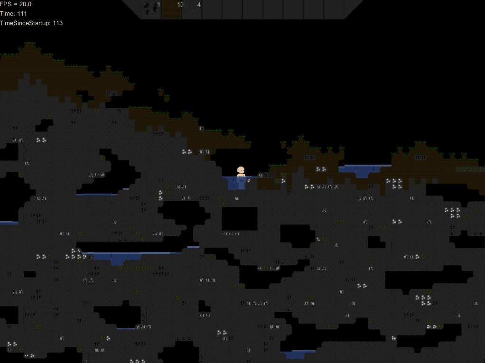

# Starbound clone draft 

    

Here is archived source code for on of my first programming project.
Its a draft of Starbound clone, i've made for self-learning.

## Implemented
- Map generation with Perlin noise
- Block placing/destruction
- Water simulation
- Basic inventory

Its not very playable, and have perfomance issues, so dont expect a lot.